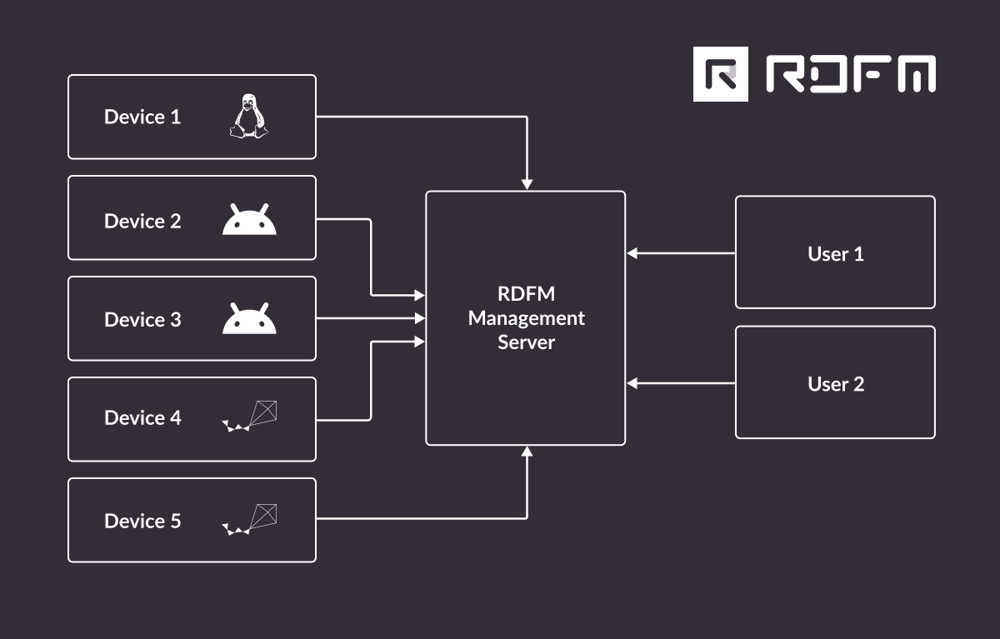

# Remote Device Fleet Manager - RDFM

Copyright (c) 2023 - 2024 [Antmicro](https://www.antmicro.com)

 

Remote Device Fleet Manager (RDFM) is an open source framework for modular, configurable, multi-OS Over-the-Air (OTA) software updates and fleet management for embedded devices, as well as ML model management.

RDFM's main features include:

* Support for devices running Linux
    * incl. support for NVIDIA Jetson modules using BSPs based on JetPack 5 and newer
* Support for devices running Android (with native updater support)
* Support for MCUs running Zephyr RTOS
* A/B partitioning schemes with auto-rollback
* Delta package updates
* Fleet management server (optional)
    * OAuth2 support for read/write permissions
    * Key-based (RSA) device authentication utilizing JSON Web Tokens for API authorization
    * Open API for easy integration with CI systems or other fleet management solutions
    * Compatible with all databases supported by SQLAlchemy

You can find out more about the framework and its capabilities in the following blog articles:
* [Introductory article and overview](https://antmicro.com/blog/2023/11/modular-configurable-multi-os-device-fleet-management-with-rdfm/)
* [RDFM delta packages overview](https://antmicro.com/blog/2024/05/efficient-ota-updates-with-rdfm-and-delta-packages/)
* [RDFM support for Zephyr-controlled MCUs](https://antmicro.com/blog/2024/07/ota-updates-for-zephyr-with-rdfm/)
* [Updates for NVIDIA BSP releases](https://antmicro.com/blog/2024/07/over-the-air-updates-using-rdfm-for-nvidia-bsps/)

Below, you can see a screencast of the Hifive Unmatched board updated with a delta package, simulated in [Renode](https://github.com/renode/renode), Antmicro's open source simulation framework.


## System architecture overview

RDFM's system stucture can be visualized as follows:


A typical RDFM system architecture consists of:
* an RDFM Management Server - handles device connections, packages, deployment, remote device management
* Devices - they connect to a central management server and utilize the exposed REST API and device-server RDFM protocol to enable remote management
* Users - individual users that are authenticated and allowed read-only/read-write access to resources exposed by the server.

## RDFM Documentation

The [RDFM documentation](https://antmicro.github.io/rdfm) provides an overview of RDFM's system architecture as well as detailed information and guides for the framework's clients, utilities, management server and API.

## Getting started - Basic server and client setup

Follow the quick tutorial below to set up an instance of an RDFM server.

### RDFM server set-up using a Docker image

The simplest method for running the RDFM server is by using a Docker container.
To set up a local development environment, first clone the RDFM repository:

```
git clone https://github.com/antmicro/rdfm.git
cd rdfm/
```

Build the container image by running the following from the root folder of the cloned repository:

```
docker build -f server/deploy/Dockerfile -t antmicro/rdfm-server:latest .
```

Then, start the server by running:

```
docker-compose -f server/deploy/docker-compose.development.yml up
```
Refer to the [Management Server chapter](https://antmicro.github.io/rdfm/rdfm_mgmt_server.html) of the RDFM documentation to learn about configuration options of the RDFM server.

### Sample Linux client setup

We provide two README files containing sample tutorials for running an RDFM Linux client to update the SiFive HiFive Unmatched board:

* [Updating the HiFive Unmatched in a physical setup](https://github.com/antmicro/meta-antmicro/blob/master/system-releases/rdfm-unmatched-demo/README.md)
* [Updating the HiFive Unmatched simulated in Renode](https://github.com/antmicro/meta-antmicro/tree/master/system-releases/rdfm-unmatched-demo/renode)

For detailed information regarding client setup, refer to the following chapters in the [RDFM documentation](https://antmicro.github.io/rdfm):

* [Linux](https://antmicro.github.io/rdfm/rdfm_linux_device_client.html)
* [Android](https://antmicro.github.io/rdfm/rdfm_android_device_client.html)
* [Zephyr RTOS](https://antmicro.github.io/rdfm/rdfm_mcumgr_device_client.html)

#### Server URL configuration

You can define the server address for a Linux RDFM client by editing the configuration contained in the `rdfm.conf` file located in the `/etc/rdfm` directory, for example:

```
{
    "ServerURL": "https://rdfm.domain.tld/"
}
```

## Repository structure

This repository contains sources for the RDFM OTA update / fleet manager system.
It is structured as follows:

* `documentation/` - sources for the RDFM documentation
* `devices/` - RDFM-compatible clients that handle communication with the RDFM management server and perform the actual update procedure
* `server/` - RDFM management server that distributes packages to connected devices
* `manager/` - CLI tool used for managing devices connected to the server
* `tools/` - tools used by RDFM components
* `common/` - common libraries used by RDFM components

For more details, see the individual README files in the directories above or refer to [the RDFM documentation](https://antmicro.github.io/rdfm).

## License

`RDFM` is licensed under the Apache-2.0 license. For details, see the [LICENSE](LICENSE) file.
