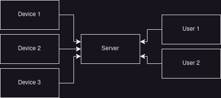

# System overview

System enables to execute parts of the architecture on distributed systems
and communicate on various devices due to standarised communication protocol.

Connection can be encrypted with TLS by using certificates on server
and clients.

## Supported devices

* devices running Linux

## System architecture

The system architecture consists of:

``rdfm_mgmt_communication`` - Communication protocol used in comunication
between server and client instances.

``rdfm_mgmt_server`` - Used as a service provider for accessing (via TCP
and HTTP) connected devices informations and estabilish proxy connection
with available device services.

``rdfm_mgmt_client`` - Used as a shell user client for server
communication (TCP-only)

``rdfm_mgmt_device`` - Client for device (TCP-only communication)

## Communication with server

Communication with server is performed by JSON API.
It is possible via TCP sockets (which `rdfm_mgmt_client` and
`rdfm_mgmt_server` use) or via HTTP requests.

Communication via TCP sockets uses the same API model but it's
encoded to enable detection of message that is corrupted or split
into multiple packets. \
It is done by adding header containing length of utf-8 encoded
JSON message - preview of the format:

```text
0        10                         10+h
+---------+----------------------------+
| HEADER  | utf-8 encoded JSON message |
+---------+----------------------------+
```
Header is a 10-bytes long number (``h`` on the graph) describing length
of the utf-8 encoded JSON message.

Requests and responses types are distinguished by ``'method'`` field

Example of request sent to server:

``{'method': 'register', 'client': {'group': 'USER', 'name': 'testuser'}}``

Example of response sent by the server:

``{'method': 'alert', 'alert': {'devices': ['d1', 'd2']}}``


:::{figure-md} summary


Summary of the system architecture
:::