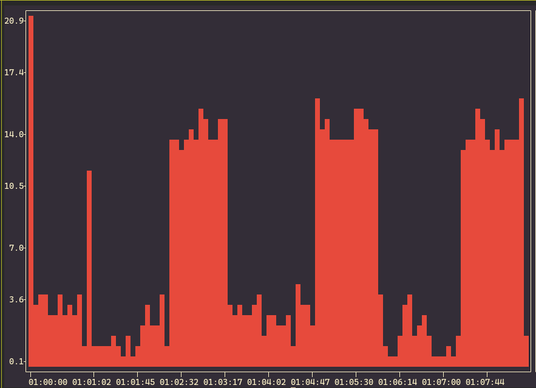
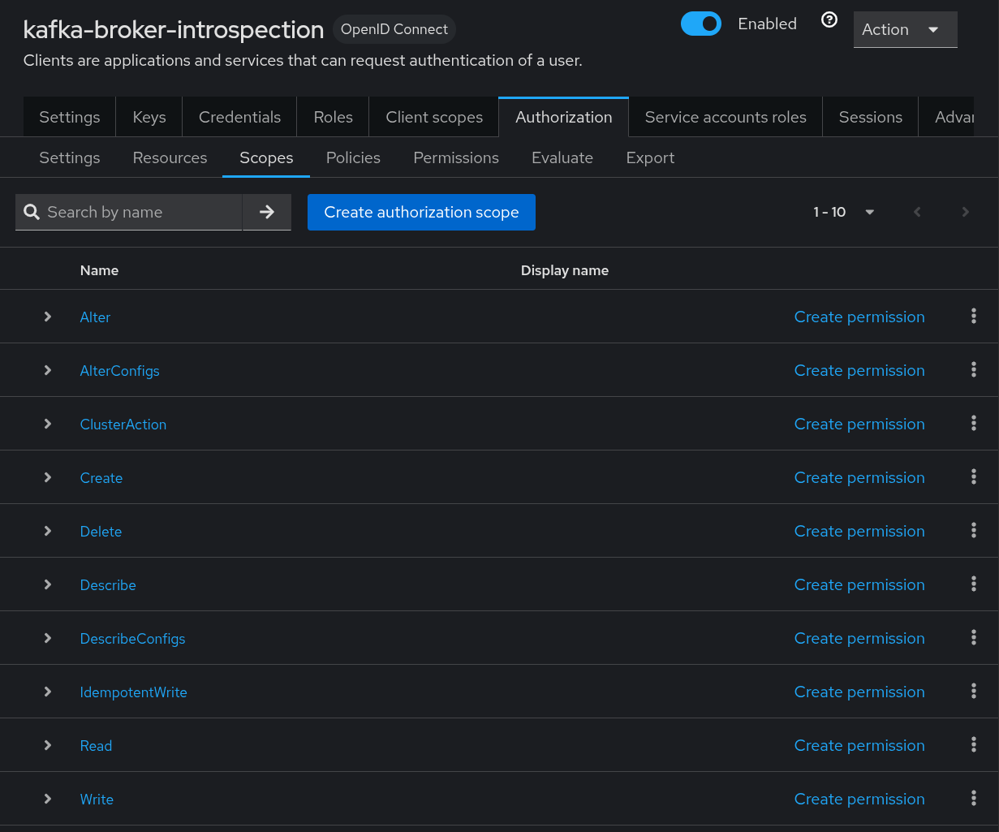
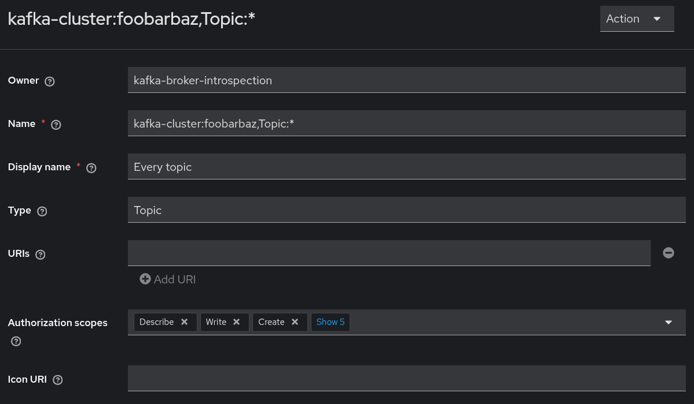
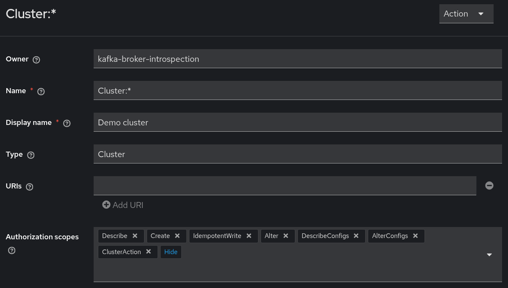
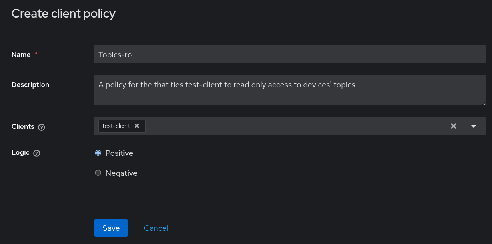
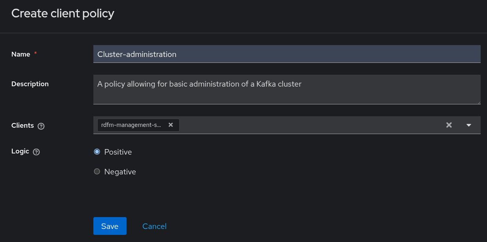
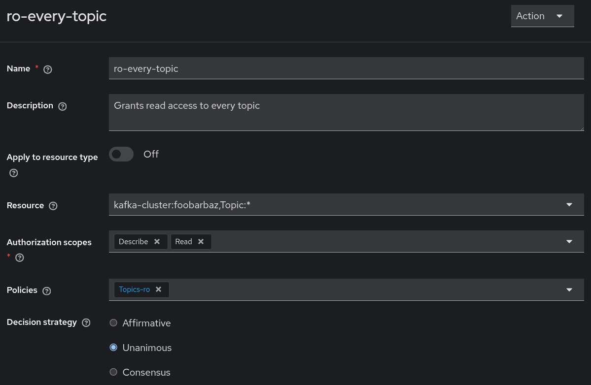
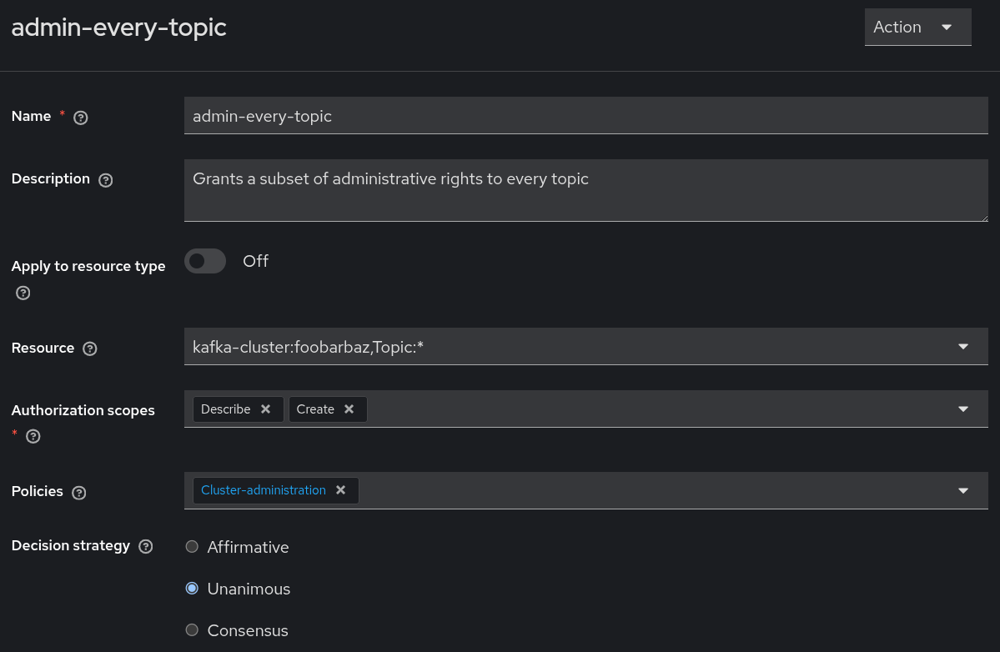
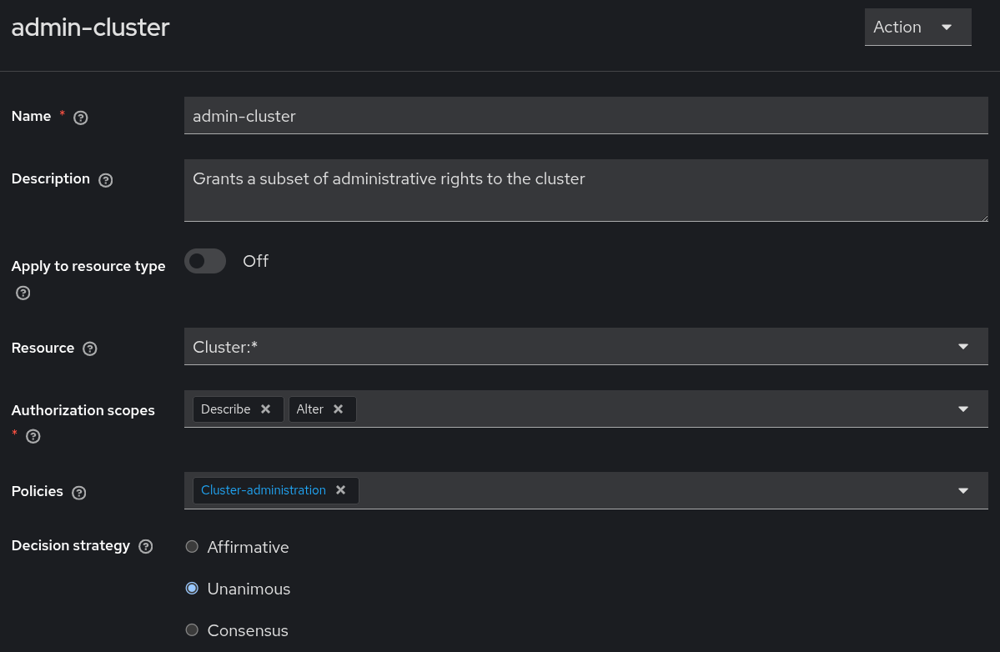

## Demo Kafka deployment

### Docker image setup

Slight modifications to the Kafka docker image are required for it to work nicely with RDFM's authentication scheme. We'll make use of `strmzi-kafka-oauth` and `rdfm-jwt-auth` to authenticate management clients and device clients respectively. Additionally, strimzi-kafka-oauth is also capable of authorization.

Build the image with:

```sh
DOCKER_BUILDKIT=1 docker build -t antmicro/kafka-for-rdfm .
```

### Keystore setup

Keystore is the means of storage of cryptographic credentials for a Kafka broker. It should have two of them, ours are:

* `KEYSTORE.p12` - for holding its own key-cert pair
* `TRUSTSTORE.p12` - for holding the root certificate

They can be password protected. To generate valid keystores for this demo deployment, first run [RDFM's certgen script](../../tests/certgen.sh):

```sh
../../tests/certgen.sh server IP:127.0.0.1,DNS:localhost,DNS:rdfm-server DEVICE no
```

It generates a `server` directory in which, alongside the key-cert pair that will be used for a RDFM server, lie `CA.crt` and `CA.key`. They are essential for generating keystores:

```sh
scripts/storegen.sh --cn broker --san IP:127.0.0.1,DNS:localhost,DNS:broker --password 123123 --destination broker --cacert server/CA.crt --cakey server/CA.key
```

The most imporant argument here is the `--cn`, which stands for Common Name. This demo cluster makes use of certificate Common Names to identify brokers during inter-broker communication. The above is reflected in the way we declare super users inside compose:

```yml
KAFKA_SUPER_USERS: User:broker;User:ANONYMOUS
```

Aside from the `ANONYMOUS` principal that should not be a super user in production, the brokers must have super user access to other brokers for replication of data and such. Without defining this, the cluster will fail to start.

#### Build RDFM server and Linux client

To run the whole demo, the server and client are also required. The server will authenticate the client. Then the client will use its credentials to authenticate with Kafka and begin sending messages.

* For the server, follow the instruction in the official [docs](https://antmicro.github.io/rdfm/rdfm_mgmt_server.html)
* For the client, from the root of the project, head to `devices/linux-client` and run:

```sh
make docker-demo-client
```

After running make for the `docker-demo-client` target, return to this directory and run:

```sh
docker build -t antmicro/rdfm-linux-demo-client-stress -f Dockerfile.demo-client-stress .
```

The above adds a couple of tweaks to how the client behaves. It adds config fields instructing it to report CPU usage and run `stress-ng`.

### Run

The following starts the Kafka broker alongside Keycloak, RDFM server, and RDFM client:

```sh
docker compose -f docker-compose.kafka.yml up # it imports docker-compose.rdfm.yml
```

note:
* If you've named your destination folder differently with `storegen.sh`, adjust the volume mount in `docker-compose.kafka.yml` accordingly.
* If you've named your destination folder differently with `certgen.sh`, adjust the volume mounts in `docker-compose.rdfm.yml` accordingly.
* The above compose also exposes a `PLAINTEXT` listener on port 19092, along with the `ANONYMOUS` superuser it allows for trivial cluster inpsection with other tooling, however such port should never be exposed on a production deployment.

After the Keycloak container is up, import the client configuration necessary for this demo:

1. Log into `127.0.0.1:8080` (or `keycloak:8080`, provided you have that aliased in `/etc/hosts`) with `admin:admin` and go to "Clients" under the "Manage" section
2. Click on "Import client", select these three: [kafka-broker-introspection.json](kafka-broker-introspection.json), [rdfm-management-server-cluster-admin.json](rdfm-management-server-cluster-admin.json), and [test-client.json](test-client.json)
3. Go to `kafka-broker-introspection` client's authorization tab
4. Under settings, import [kafka-broker-introspection-test-authz-config.json](kafka-broker-introspection-test-authz-config.json)
5. **Important**: Remove the `Default Resource` from resources under the authorization tab, otherwise `KeycloakAuthorizer` will refuse to work as this resource doesn't follow the `TYPE:NAME` pattern

note:
* A more in depth optional walkthrough regarding Keycloak configuration with small drops of knowledge can be found in the [manual section](#manual-keycloak-configuration). For comprehensive information on the way strimzi-kafka-oauth works, refer to its [README](https://github.com/strimzi/strimzi-kafka-oauth/blob/ac0257e009e980fc68ea0acb2ad7e1d816718220/README.md).

After the RDFM management server is up, the client sends an authentication request. Accept it using the [`rdfm-mgmt` tool](../../../manager):

```sh
rdfm-mgmt --url https://localhost:5000 --cert ./server/CA.crt devices auth 02:42:ac:1a:00:02 # Change your device's MAC address
```

note:
* If you're using this utility inside a docker container attached to the `rdfm` network, substitute `localhost` with `rdfm-server`.
* API authentication requires the management tool to authenticate itself with the correct client ID/secret configured inside Keycloak. A working config for the demo deployment is available [here](./rdfm-mgmt-config.json) (assuming you have `keycloak` aliased to `localhost`/`127.0.0.1` in `/etc/hosts`). The tool looks for this config in `~/.config/rdfm-mgmt/config.json` by default. A `--config` flag is also available.

After authenticating the client, it will start sending logs to its assigned topic on the broker. In the compose log you should see the management server working on getting the topic set up, as well as the broker authorizing the device client to write to said topic using the JWT secret.

```
broker               | [2026-04-15 11:42:50,426] INFO [ReplicaFetcherManager on broker 1] Removed fetcher for partitions Set(02-42-ac-1a-00-02-0) (kafka.server.ReplicaFetcherManager)
broker               | [2026-04-15 11:42:50,436] INFO [LogLoader partition=02-42-ac-1a-00-02-0, dir=/tmp/kraft-combined-logs] Loading producer state till offset 0 (org.apache.kafka.storage.internals.log.UnifiedLog)
broker               | [2026-04-15 11:42:50,438] INFO Created log for partition 02-42-ac-1a-00-02-0 in /tmp/kraft-combined-logs/02-42-ac-1a-00-02-0 with properties {} (kafka.log.LogManager)
broker               | [2026-04-15 11:42:50,438] INFO [Partition 02-42-ac-1a-00-02-0 broker=1] No checkpointed highwatermark is found for partition 02-42-ac-1a-00-02-0 (kafka.cluster.Partition)
broker               | [2026-04-15 11:42:50,440] INFO [Partition 02-42-ac-1a-00-02-0 broker=1] Log loaded for partition 02-42-ac-1a-00-02-0 with initial high watermark 0 (kafka.cluster.Partition)
rdfm-server-1        | 172.27.0.3 - - [15/Apr/2026 11:42:50] "POST /api/v1/pubsub/request_topic HTTP/1.1" 200 -
broker               | Apr 15, 2026 11:42:50 AM com.antmicro.rdfm.DeviceAuthenticateCallbackHandler isValidToken
broker               | INFO: : Validated device: 02:42:ac:1a:00:02.
```

You can inspect these logs with the [`rdfm-plotter` utility](../../../tools/rdfm-plotter). Follow its [README](../../../tools/rdfm-plotter/README.md) for configuration details. The default config provided in `example*` files also conforms to this demo deployment.

```sh
rdfm-plotter --print -d  02:42:ac:1a:00:02 # Change your device's MAC address
```

And plot them:

```sh
 rdfm-plotter --plot -d 02:42:ac:1a:00:02 --key CPU --pattern '"usr":([0-9]+\.[0-9]+)'  -o 0.5
```

note: The [example consumer configuration](../../../tools/rdfm-plotter/example_consumer_config.json) has such a line: `"bootstrap_servers": "localhost:9094",`.
It contains a list of one or more servers to which the clients connects at first to begin a full-fledged connection to the cluster.
In the case of this demo, the telemetry endpoints are advertised via their docker node names (via ` KAFKA_ADVERTISED_LISTENERS` field in the compose yaml), meaning the begin with `broker:`, followed by some port.
Therefore, after connecting to `localhost:9094`, a client would start to hit `broker:9093` or `broker:9094` and so on, thus making such an entry in `/etc/hosts` necessary:

```
127.0.0.1       broker
```

If the above line isn't present in `/etc/hosts`, rdfm-plotter will fail at gathering any logs.



Userspace CPU time usage in %.

### Manual Keycloak configuration

This manual walkthrough is not going to result in a setup compatible with these vendored example configuration files:
* [`secrets.env`](./secrets.env) for the Docker Compose configuration
* [`server.properties`](./server.properties) passed to the Kafka broker
* [`example_keycloak_config.json`](../../../tools/rdfm-plotter/example_keycloak_config.json) for `rdfm-plotter`

It's due to the fact that by creating a new client, as opposed to importing one, Keycloak generates a new random secret. Thus, if you follow the below guide, you will need to modify these files by hand with your newly generated secrets.

#### Initial setup of introspection client

Management listener (prefixed with `MGMT://` in [`docker-compose.kafka.yml`](./docker-compose.kafka.yml)) does authentication as well as authorization using Keycloak. To configure that behavior we first need to create a client for the broker to introspect tokens with:

1. Log into Keycloak with the default credentials (`admin:admin`)
2. Head to the clients tab
3. Click on create client
4. In general settings, choose an ID, e.g.: `kafka-broker-introspection`
5. In capability config, set client authentication and authorization to on
6. Save

After it's saved, configure the authorization scopes, which define the possible actions that can be done on a cluster:

1. Head to clients tab
2. Click on the previously created introspection client
3. Under that client, head to the authorization tab
4. Under the authorization tab, head to the settings tab
5. Click the import button and import the settings from [`authorization-scopes.json`](authorization-scopes.json)
6. Confirm that the changes have taken place by heading to the scopes tab



#### Resources

Next, configure the resources which define where the authorization rules should apply. For this demo the resources are going to be:
* Our cluster composed of a single broker.
* A wildcard resource denoting every topic on the cluster.

Starting off with the topic resource:

1. Head to clients tab
2. Click on the previusly created introspection client, in the case of this guide it's called `kafka-broker-introspection`
3. Head to its authorization tab
4. Under that tab, head to the resources tab
5. **Important**: If present, delete the `Default Resource` as its name is not compatible with strimzi-kafka-oauth's way of parsing resource names.
6. Create a new resource with the name of `kafka-cluster:foobarbaz,Topic:*` (as that's the name configured in [server.properties](./server.properties), a detailed description of resoruce naming can be found in [strimzi-kafka-oauth's README](https://github.com/strimzi/strimzi-kafka-oauth/blob/ac0257e009e980fc68ea0acb2ad7e1d816718220/README.md)), optionally you can also declare it to be of type `Topic`. The display name can be whatever e.g.: `Every topic`
7. Define a list of possible authorization scopes that make sense for that resource, for this example `Read` and `Describe` are enough, however, according to the [strimzi-kafka-oauth's guide in its README](https://github.com/strimzi/strimzi-kafka-oauth/blob/ac0257e009e980fc68ea0acb2ad7e1d816718220/README.md), all the scopes that matter for a `Topic` type resouce are: `Write`, `Read`, `Describe`, `Create`, `Delete`, `DescribeConfigs`, `AlterConfigs`, and `IdempotentWrite`



Moving onto the cluster resource:

1. Head to clients tab
2. Click on the previusly created introspection client, in the case of this guide it's called `kafka-broker-introspection`
3. Head to its authorization tab
4. Under that tab, head to the resources tab
5. Create a new resource with the name of `Cluster:*`, optionally you can also declare it to be of type `Cluster`
6. Declare the authorization scopes, those that matter for the cluster are: `Create`, `Describe`, `Alter`, `DescribeConfigs`, `AlterConfigs`, `IdempotentWrite`, and `ClusterAction`



#### Additional clients

There's also a need for additional clients that will interact with the cluster. The two that are needed for this demo are:

* A management client with the ability to read topics to which the devices write. For use with the [`rdfm-plotter` utility](../../../tools/rdfm-plotter). Its ID is going to be `test-client`. It could also be an already existing client. In the case of the [demo realm](../rdfm-realm-template.json), there's also `rdfm-client` available which is used by the `rdfm-mgmt` tool.
* A client with a subset of admin privileges over the entire cluster. For use by the RDFM management server to dynamically provision topics for devices. Its ID is going to be `rdfm-management-server-cluster-admin`.

To create each of these two clients:

1. Head to clients tab
2. Create client
3. Choose a client ID, e.g.: `test-client`
4. In capability config, set "Client authentication" to `on` and tick off the `Service account roles` checkbox so it's enabled

#### Policies

The next thing that needs to be done is creating policies, two are reqiured, one each for the new clients:
* For `test-client`, it's a policy that will be attached to read only permission to every topic on the cluster (previously denoted by `kafka-cluster:foobarbaz,Topic:*`)
* For `rdfm-management-server-cluster-admin`, it's going to be a policy attached to partial administrative access over a cluster, RDFM management server will leverage that access to create topics and modify access control lists.

For `test-client`:

1. After creating the new client head back to the authorization tab of the introspection client (in the case of this document, it's `kafka-broker-introspection`)
2. Under the authorization tab, head to the policies tab
3. Create a policy of type client and add `test-client` to it
4. Come up with some descriptive name for that policy, e.g.: `Topics-ro`
5. Leave the logic as positive



For `rdfm-management-server-cluster-admin`:

1. After creating the new client head back to the authorization tab of the introspection client
2. Under the authorization tab, head to the policies tab
3. Create a policy of type client and add `rdfm-management-server-cluster-admin` to it
4. Come up with some descriptive name for that policy, e.g.: `Cluster-administration`
5. Leave the logic as positive



#### Permissions

Finally, create the permissions and assign them to their respective policies:

For the `test-client`, only a single permission is required to facilitate reading topics:

1. Head to clients clients tab
2. Click on the introspection client previusly created
3. Under that client, head to the authorization tab
4. Under the authorization tab, head to the permissions tab
5. Click on create scoped-based permission
6. Choose some name, e.g.: `ro-every-topic`
7. Make the permission tied to the `kafka-cluster:foobarbaz,Topic:*` resource
8. The required scopes for this permission that will allow for reading are `Describe` and `Read` (as `Describe` will allow to fetch metadata about the topic)
9. Make the permission tied to the `Topics-ro` policy from the previous step



For the `rdfm-management-server-cluster-admin`, two permissions are going to be necessary.

1. Head to clients clients tab
2. Click on the introspection client previusly created
3. Under that client, head to the authorization tab
4. Under the authorization tab, head to the permissions tab
5. Click on create scoped-based permission
6. Choose some name, e.g.: `admin-every-topic`
7. Make the permission tied to the `kafka-cluster:foobarbaz,Topic:*` resource
8. Choose a set of required authorization scopes. For our use case, `Create` and `Describe` are exactly what's required (the management server only checks is a topic exists, creates it if it's not already present)
9. Make the permission tied to the `Cluster-administration` policy from the previous step
10. Create another scope based permission
11. Choose some name, e.g.: `admin-cluster`
12. Make the permissions tied to the `Cluster:*` resource
13. Choose a set of required authorization scopes. For ACL deletion and creation the only one required is actually the `Alter` scope. Additonaly there's `Describe` for fetching them at first.
14. Make that permission also tied to the `Cluster-administration` policy from the previous step





